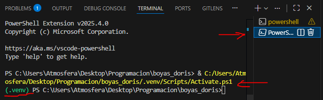

# Boyas DORIS - Sistema de Procesamiento de Datos Oceanográficos

Sistema completo en Python para cargar, procesar, corregir y visualizar datos obtenidos de sondas oceanográficas DORIS. El proyecto está diseñado de manera modular para facilitar el análisis de parámetros oceanográficos como temperatura, corrientes marinas, rapidez y dirección.

> **📖 Nota**: Para ver este archivo correctamente con formato, usa la vista previa de Markdown en VS Code (presiona `Ctrl+Shift+V` o haz clic derecho y selecciona "Abrir vista previa").

---

## 📋 Tabla de Contenidos

- [Descripción General](#descripción-general)
- [Estructura del Proyecto](#estructura-del-proyecto)
- [Características del Sistema (Explicación de los Módulos)](#características-del-sistema-explicación-de-los-módulos)
- [Requisitos del Sistema](#requisitos-del-sistema)
- [Instalación](#instalación)
- [Configuración](#configuración)
- [Uso del Sistema](#uso-del-sistema)
- [Dependencias](#dependencias)
- [Solución de Problemas](#solución-de-problemas)

---

## 📖 Descripción General

Este sistema permite procesar datos de múltiples sondas oceanográficas DORIS de manera automatizada. Incluye funcionalidades para:

- **Carga de datos** desde archivos CSV
- **Limpieza y corrección** de datos espurios y duplicados
- **Procesamiento temporal** con sincronización de fechas
- **Cálculo de componentes** de velocidad (u, v) a partir de datos polares
- **Visualización** mediante gráficos de series temporales
- **Generación de estadísticas** y porcentajes de transmisión de datos

El sistema está diseñado para trabajar con múltiples sondas simultáneamente y procesar datos en intervalos de 30 minutos o 1 hora.

**Se recomienda usar python versión 3.14**
---

## 🗂️ Estructura del Proyecto

```
boyas_doris/
│
├── Configs/                              # Módulo de configuración
│   ├── __init__.py
│   ├── configuracion_general.py          # Configuración centralizada del sistema
│   └── diccionario_variables.py          # Diccionario de variables oceanográficas
│
├── Funciones/                            # Módulos funcionales
│   ├── __init__.py
│   │
│   ├── Carga/                            # Módulo de carga de datos
│   │   ├── __init__.py
│   │   └── cargar_datos_csv.py           # Funciones de carga y procesamiento inicial
│   │
│   ├── Correctores/                      # Módulo de corrección de datos
│   │   ├── __init__.py
│   │   └── corrector_utils.py            # Utilidades para limpieza y corrección
│   │
│   ├── Graficado/                        # Módulo de visualización
│   │   ├── __init__.py
│   │   ├── graficar_series_y_guardar.py  # Función principal de graficado y guardado
│   │   ├── Gra_serie_de_tiempo.py        # Graficado de series temporales
│   │   ├── Gra_calcular_ylim.py          # Cálculo de límites del eje Y
│   │   ├── Gra_asignar_ylim.py           # Asignación de límites del eje Y
│   │   ├── Gra_calcular_xticks.py        # Cálculo de marcas del eje X
│   │   ├── GraFormatoFecha.py            # Formateo de fechas en gráficos
│   │   └── base/
│   │       └── Gra_corrientes_transmision.py  # Gráficos de corrientes
│   │
│   └── Utils/                            # Utilidades generales
│       ├── __init__.py
│       ├── utilidades.py                 # Funciones auxiliares comunes
│       ├── utils_get_config_vars.py      # Obtención de variables de configuración
│       └── utils_get_vars_dic.py         # Obtención de variables del diccionario
│
├── Mains/                                # Notebooks principales
│   ├── main_cargar_datos.ipynb          # Notebook para carga de datos
│   ├── main_graficar_datos.ipynb        # Notebook para visualización
│   └── main_calcular_porcentajes.ipynb  # Notebook para estadísticas
│
├── requirements.txt                      # Dependencias del proyecto
└── README.md                            # Este archivo
```

---

## ✨ Características del Sistema (Explicación de los Módulos)

### 1. **Módulo de Configuración** (`Configs/`)
**Archivos:**
- `configuracion_general.py`: Diccionario con todos los parámetros del sistema
- `diccionario_variables.py`: Diccionario de variables y parámetros oceanográficos

**Configuración centralizada** con parámetros configurables:
- Rango de fechas de análisis
- Seriales de sondas a procesar
- Rutas de entrada/salida
- Configuración de gráficos (formato, resolución, fuentes)
- Parámetros de procesamiento (delta de tiempo, bins de histogramas)

### 2. **Módulo de Carga** (`Funciones/Carga/`)
**Archivo:** `cargar_datos_csv.py`

**Funciones principales:**
- `crear_ruta_al_excel_de_despliegue_de_sondas()`: Construye ruta usando variables de entorno (.env)
- `buscar_nombre_de_archivo_de_sonda()`: Localiza archivos CSV por serial de sonda
- `cargar_datos_de_sonda()`: Carga datos desde archivos CSV en un diccionario
- `leer_excel_de_despliegue_de_sondas()`: Lee metadatos de despliegue de sondas
- `seleccionar_rango_de_fechas()`: Filtra datos por rango temporal configurado
- `buscar_y_eliminar_duplicados()`: Detecta y elimina registros duplicados
- `ordernar_datos_por_fecha()`: Ordena cronológicamente los datos
- `crear_tspan_redondeado()`: Redondea timestamps a intervalos regulares (30min/1h)
- `existen_fechas_redondeadas_duplicadas()`: Verifica duplicados después del redondeo
- `crear_diccionario_con_dataframes_vacios()`: Genera DataFrames vacíos con timestamps sintéticos
- `merge_df_vacio_con_datos()`: Combina serie temporal completa con datos reales (NaN para faltantes)
- `agregar_componentes_de_la_velocidad()`: Calcula componentes u y v desde dirección/rapidez

### 3. **Módulo de Correctores** (`Funciones/Correctores/`)
**Archivo:** `corrector_utils.py`

**Funciones de limpieza:**
- `buscar_duplicados_explicitos()`: Identifica registros duplicados con conteo de repeticiones
- `eliminar_datos_duplicados()`: Elimina duplicados explícitos del DataFrame
- `eliminar_datos_espurios()`: Reemplaza con NaN filas con rapidez > 2 m/s (datos irreales)
- `interpolar_datos_faltantes()`: Interpola valores NaN usando interpolación lineal
- `ordenar_df_por_fecha()`: Ordena DataFrame por columna de fecha

### 4. **Módulo de Graficado** (`Funciones/Graficado/`)
**Archivos:**
- `graficar_series_y_guardar.py`: Función principal de graficado y guardado de figuras
- `Gra_serie_de_tiempo.py`: Graficado de series temporales
- `Gra_calcular_ylim.py`: Cálculo automático de límites del eje Y
- `Gra_asignar_ylim.py`: Asignación de límites personalizados del eje Y
- `Gra_calcular_xticks.py`: Cálculo de marcas del eje X temporal
- `GraFormatoFecha.py`: Formateo de fechas en gráficos
- `base/Gra_corrientes_transmision.py`: Gráficos especializados para corrientes y transmisión

**Capacidades de visualización:**
- `graficar_series_y_guardar()`: Función principal que genera figuras completas por sonda
- `Gra_corrientes_transmision()`: Crea gráficos de 5 subplots (Temperatura, u, v, Rapidez, Dirección)
- `Gra_serie_de_tiempo()`: Graficado individual de series temporales
- `Gra_calcular_ylim()`: Cálculo automático de límites del eje Y con márgenes
- `Gra_asignar_ylim()`: Asignación personalizada de límites del eje Y
- `Gra_calcular_xticks()`: Calcula marcas temporales inteligentes para el eje X
- `GraFormatoFecha()`: Formateo de fechas según duración de la serie temporal
- **Configuración flexible**: Resolución, formato (PNG/JPG), fuentes personalizables
- **Modo sin visualización**: Generación batch con `plt.ioff()` y `plt.close()`

### 5. **Módulo de Utilidades** (`Funciones/Utils/`)
**Archivos:**
- `utilidades.py`: Funciones auxiliares (conversiones, guardado, exportación a Excel)
- `utils_get_config_vars.py`: Obtención de variables de configuración
- `utils_get_vars_dic.py`: Obtención de variables del diccionario

**Herramientas auxiliares:**
- `calcular_porcentaje_de_datos_recibidos()`: Calcula % de transmisión exitosa vs esperada
- `calcular_porcentaje_de_datos_interpolados()`: Calcula % de datos interpolados
- `cambiar_fechas_a_pd_datetime()`: Convierte columnas de fecha a formato datetime de Pandas
- `cargar_diccionario_pickle()`: Carga diccionarios guardados en formato pickle
- `guardar_diccionario_como_pickle()`: Guarda diccionarios en formato pickle
- `crear_rango_de_fechas_sintetico()`: Genera rango de fechas con intervalo configurable
- `guardar_figura()`: Guarda figuras con configuración personalizada (resolución, formato)
- `guardar_porcentajes_en_excel()`: Exporta estadísticas a Excel con formato profesional
- `polar2uv()`: Convierte coordenadas polares (dirección/rapidez) a cartesianas (u, v)
- `uv2polar()`: Convierte coordenadas cartesianas (u, v) a polares (dirección/rapidez)

### 6. **Variables de Ambiente** (`.env`)
Archivo en la raíz del proyecto para proteger rutas al NAS y mantener la privacidad.

**Configuración:**
```dotenv
ruta_al_NAS = 192.XXX.XXX.XXX
```

---

## 💻 Requisitos del Sistema

- **Python**: 3.14.0
- **Sistema Operativo**: Windows, macOS o Linux
- **Espacio en disco**: Mínimo 500 MB para dependencias

---

## 🚀 Instalación

### Instalación Paso a Paso

#### 1. **Instalar Python**
Descarga e instala la versión 3.14 de Python desde [python.org](https://www.python.org/downloads/).

**Se recomienda instalarlo en c:/python/"python_version"**
e.g. c:/python/python_3.14

**Verificar instalación actual y global:**
```powershell
python --version
```

Nota: Si no te aparece es que no se configuró correctamente durante la instalación para agregar al PATH.
Se recomienda volver a instalar el python seleccionando las opciones correctas.

#### 2. **Clonar o descargar el proyecto**
Descarga el proyecto en tu computadora y navega a la carpeta:
```powershell
cd C:\ruta\a\boyas_doris
```

#### 3. **Crear ambiente virtual**
Es **altamente recomendado** usar un ambiente virtual para aislar las dependencias:
Recuerda usar la versión de python 3.14
Si está instalado como global, al ejectuar
```powershell
python --version
```
Saldrá la versión 3.14

Si esto es así usar el comando directo
```powershell
python -m venv .venv
```

De lo contrario, usa el comando
```powershell
python3.14 -m venv .venv
```

Esto creará una carpeta `.venv` con el ambiente virtual.

**Otra forma de hacerlo**
Si no te funciona así
puedes hacer 
```powershell
c:/python/python_3.14/python -m venv .venv
```

Nota: Por eso se sugería usar una ruta sencilla durante la instalación de python en el punto 1.

#### 4. **Activar el ambiente virtual**

**En Windows (PowerShell):**
```powershell
.\.venv\Scripts\Activate.ps1
```

**En Windows (CMD):**
```cmd
.venv\Scripts\activate.bat
```

**En macOS/Linux:**
```bash
source .venv/bin/activate
```

Verás el nombre del ambiente `(.venv)` al inicio de la línea en la terminal.



#### 5. **Instalar dependencias**
Con el ambiente virtual activo, instala todas las bibliotecas necesarias:

```powershell
pip install -r requirements.txt
```

Este comando instalará automáticamente todas las dependencias listadas en `requirements.txt`.


#### 6. **Instalar variables de ambiente** (.env)
Para mantener rutas y datos sensibles fuera del código y del repositorio, puedes usar variables de ambiente con un archivo `.env`. Esto permite configurar rutas privadas (por ejemplo, la ruta a un NAS) sin exponerlas en GitHub.

**Crea el archivo `.env` en la raíz del proyecto:**

  En la raiz del proyecto agrega el archivo .env y coloca en el contenido lo siguiente:
  ```dotenv
  ruta_al_NAS = 192.XXX.XXX.XXX
  ```
  Reemplaza esto 192.XXX.XXX.XXX por la ruta al NAS.


#### 6. **Verificar instalación**
Verifica que las bibliotecas principales se instalaron correctamente:

```powershell
pip list
```

Deberías ver paquetes como: pandas, numpy, matplotlib, scipy, openpyxl, jupyter, etc.

---

## ⚙️ Configuración

### Archivo de Configuración Principal

Edita el archivo `Configs/configuracion_general.py` para ajustar los parámetros según tus necesidades:

```python

```

### Estructura de Archivos CSV de Entrada

Los archivos CSV deben contener las siguientes columnas (en orden):
1. `fecha` - Timestamp de transmisión
2. `latitud` - Latitud de la sonda
3. `longitud` - Longitud de la sonda
4. `rapidez` - Rapidez de corriente (m/s)
5. `distancia` - Distancia recorrida
6. `direccion_grados` - Dirección en grados (0-360)
7. `direccion_texto` - Dirección en texto (N, NE, E, etc.)
8. `temperatura` - Temperatura del agua (°C)

---

## 📊 Uso del Sistema

### Flujo de Trabajo Completo

#### **Paso 1: Cargar Datos**
Ejecuta el notebook `main_cargar_datos.ipynb`:
1. Abre Jupyter Notebook o VS Code
2. Navega a `Mains/main_cargar_datos.ipynb`
3. Ejecuta todas las celdas

**Este notebook:**
- Carga archivos CSV de las sondas especificadas
- Filtra por rango de fechas
- Elimina duplicados
- Redondea timestamps
- Crea serie temporal completa con NaN para datos faltantes
- Elimina datos espurios (rapidez > 2 m/s)
- Calcula componentes u y v de velocidad
- Guarda datos procesados en formato pickle

#### **Paso 2: Corregir Datos Espurios** (Pendiente de desarrollar)
Ejecuta `main_corregir_datos_espurios.ipynb`:
- Aplica correcciones adicionales
- Interpola datos faltantes si es necesario

#### **Paso 3: Calcular Estadísticas**
Ejecuta `main_calcular_porcentajes.ipynb`:
- Calcula porcentajes de datos recibidos
- Genera reportes de calidad de datos
- Exporta estadísticas a Excel

#### **Paso 4: Graficar Datos**
Ejecuta `main_graficar_datos.ipynb`:
- Genera gráficos de series temporales
- Crea visualizaciones para cada sonda
- Opcionalmente guarda figuras en alta resolución


## 📚 Dependencias

El archivo `requirements.txt` incluye las siguientes bibliotecas principales:

| Biblioteca | Versión | Uso |
|------------|---------|-----|
| **pandas** | 2.3.3 | Manipulación y análisis de datos |
| **numpy** | 2.4.0 | Operaciones numéricas y arrays |
| **matplotlib** | 3.10.8 | Generación de gráficos |
| **scipy** | 1.16.3 | Interpolación y procesamiento científico |
| **openpyxl** | 3.1.5 | Lectura/escritura de archivos Excel |
| **ipykernel** | 7.1.0 | Kernel de Jupyter para notebooks |
| **ipython** | 9.8.0 | Shell interactivo de Python mejorado |
| **python-dotenv** | 1.2.1 | Gestión de variables de ambiente desde .env |
| **jupyter_client** | 8.7.0 | Cliente de Jupyter para comunicación con kernels |
| **jupyter_core** | 5.9.1 | Funcionalidad núcleo de Jupyter |

### Dependencias Completas

Para ver todas las dependencias instaladas:
```powershell
pip list
```
---

## 🔧 Solución de Problemas

### Error: "No module named..."
**Solución**: Asegúrate de tener el ambiente virtual activado e instala las dependencias:
```powershell
pip install -r requirements.txt
```

### Error: "FileNotFoundError"
**Solución**: Verifica que las rutas en `configuracion_general.py` sean correctas y que los archivos CSV existan.

### Problemas con permisos en PowerShell
**Solución**: Ejecuta PowerShell como administrador y permite la ejecución de scripts:
```powershell
Set-ExecutionPolicy -ExecutionPolicy RemoteSigned -Scope CurrentUser
```

---

## 👥 Autor

**Fernando Bello Fuentes**  
📧 bellodev

---

## 📄 Licencia

Este proyecto es de uso interno para análisis de datos oceanográficos de sondas DORIS.

---

## 📝 Notas Adicionales

- **Formato de fechas**: El sistema espera fechas en formato `YYYY-MM-DD HH:MM`
- **Nombres de archivos CSV**: Deben contener el serial de la sonda en el nombre
- **Datos faltantes**: Se representan como `NaN` en los DataFrames
- **Coordenadas**: Dirección en grados náuticos (0°=Norte, 90°=Este, etc.)
- **Rendimiento**: El procesamiento de múltiples sondas puede tardar varios minutos

---

**¡Listo para usar! Si tienes dudas, revisa los notebooks en `Mains/` para ver ejemplos de uso.**

## Uso
1. Coloca los archivos de datos de las sondas DORIS en el directorio del proyecto.
2. Ejecuta el script principal de Python o el notebook.
3. Sigue las instrucciones para visualizar los gráficos generados.